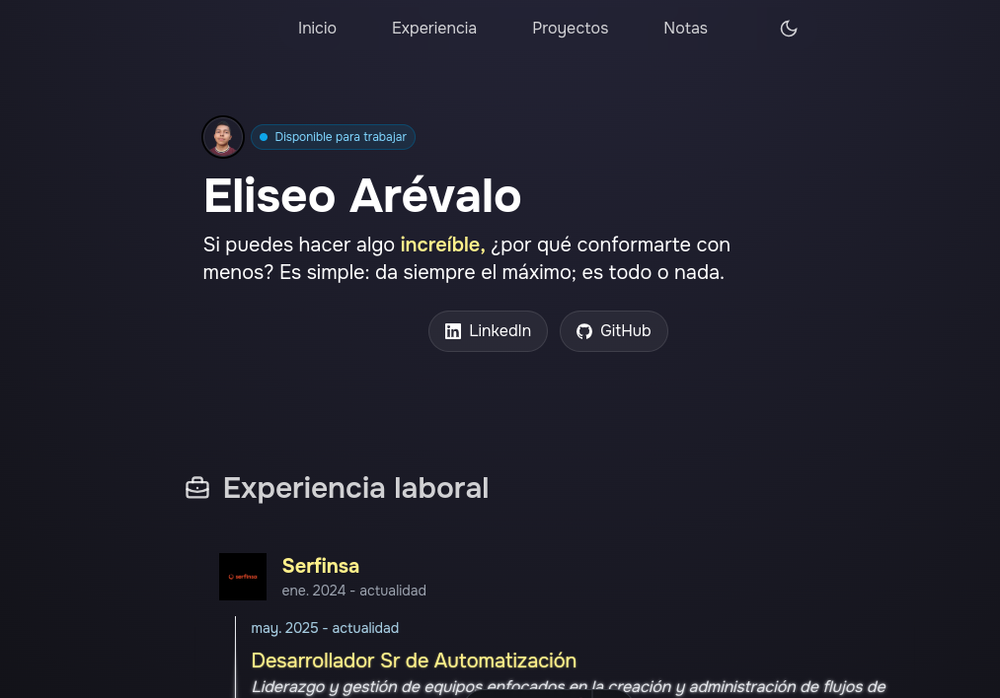

# Eliseo Arévalo - Portfolio



A modern portfolio built with Astro, React, and Tailwind CSS. 

Features interactive diagrams and responsive design.

**Tech Stack**: Astro 5.9, React 19, TypeScript, Tailwind CSS, MDX, Excalidraw

## Quick Start

```bash
git clone https://github.com/eliseo-arevalo/portfolio.git
cd portfolio
pnpm install
pnpm dev
```

## Features

- Interactive Excalidraw diagrams
- Mobile-responsive navigation
- Dark/light theme toggle
- MDX blog posts
- Static site generation

## Structure

```
src/
├── components/     # UI components
├── content/notas/  # Blog posts & diagrams
├── layouts/        # Page layouts
└── pages/          # Routes
```

**Live Demo**: [eliseo-arevalo.github.io](https://eliseo-arevalo.github.io)